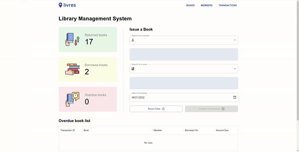
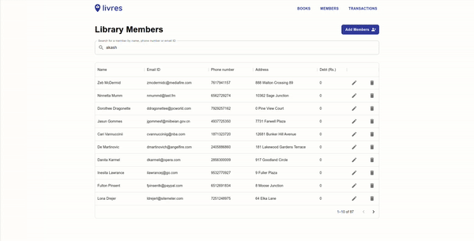

# livres

livres is a simple web application used for library management.

_Logo made using [this](https://www.adobe.com/express/create/logo)._

---

## Tech Stack

- The front end for this project has been written in `TypeScript` and uses `React` along with `MUI` for styling and components.
- The back end is written in `Python` and uses `flask` with `SQLite3` serving as the database and `SQLAlchemy` for the ORM.

## Functions

The application provides a user interface to the librarian who is supposed to run and manage the library transactions. The librarian is able to perform the following functions:-

- Issuing books to members and recording date of borrowing.
- Tracking status of books lent out and maintaining list of overdue books.

- Issuing book returns and recording date of returning.
- Altering dates or deleting records of pending as well as completed transactions.

- Importing books from an [external API](https://frappe.io/api/method/frappe-library) into the user's sytem by searching for the name, author, isbn code or publisher and then selecting the number of books to be imported.
- The imported stock of books can be viewed, searched and managed through the application.

- Registering new members to the library and managing existing ones.
- Maintaining records of the debt owed by each member to the library.
- A member owing more than Rs. 500 is unable to borrow new books till he returns what he owes.

_Icons by [max.Icons](https://www.flaticon.com/packs/borrow-book-2). Lottie by [Pablo Gringas](https://lottiefiles.com/98121-empty-state)._

## Usage

To run this application on your system, open a terminal and

- Clone this repository by running `git clone https://github.com/krantheman/livres`.
- Install python dependencies by running `pip install -r requirements.txt`
- Export flask app variable with `export FLASK_APP=server`
- Run server with `flask run`
- Next, open a new terminal instance and `cd client`.
- Install packages by running `npm install`.
- Start server with `npm start`.
